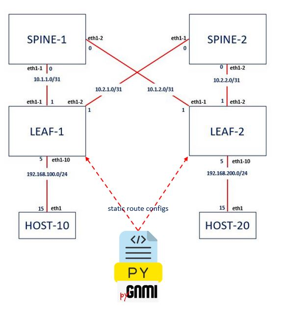

# Network Automation Demo

I prepared this repo to demo how we can implement the configurations on SRLinux Routers via gNMI.
The python code utilizes the pygnmi module, in order to send set operations to push the missing static route configs to the Leaf devices.
After the python code sucessfully pushes the configs, the hosts are going to be able to ping each other.

For the Demo, SRLinux devices are going to show up in the containerlab environment.

**Here are the steps for the demo**

## Deploy the test topology
> git clone https://github.com/muzafferkahraman/network_automation_demo
> cd network_automation_demo
> clab deploy -t lab_deploy.yml --reconfigure

## Testing connectivity between the hosts
> docker exec -ti host10 ping 192.168.200.15 \n
> docker exec -ti host20 ping 192.168.100.15 \n

## Push the missing static route configs
> python3 gnmi_push_config.py

## Pre-requisite
You need to deploy containerlab, beforehands to run this lab

To install containerlab (CentOS 7)
> yum-config-manager --add-repo=https://yum.fury.io/netdevops/ && echo "gpgcheck=0" | 
> sudo tee -a /etc/yum.repos.d/yum.fury.io_netdevops_.repo  
>
> yum install containerlab

for other distros, please refer to 
https://containerlab.dev/install/
